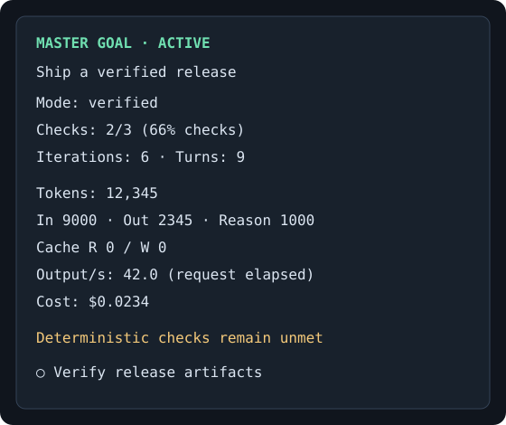

# Master Goal

**File-first goal orchestration for OpenCode 2.x. The model does the work. The host checks the result.**

Master Goal is an original implementation, built from scratch. It is not a fork of OpenCode Goals. It separates the agent's reasoning from the authority to declare completion.

A run locks a `goal.md` contract and the verifier scripts it references. Every deterministic check must pass before the run can complete. An optional independent reviewer can veto success. Model prose, completion promises, completed todos, and arguments that a goal is impossible cannot mark a run complete.

Explicit **forever mode** has no success transition and no default iteration, token, cost, or elapsed-time cap. `/goal stop` or `/goal end` stops it. Host shutdown, permission waits, errors, and unavailable providers can interrupt execution; none count as success.

## Quick install

Requires Node.js 22+, npm, Git, and **OpenCode 2.x** (tested with 2.0.22). Version 0.3.0 removes OpenCode 1.x support. `--host 1` is rejected; `--host 2` is accepted for older install commands but is no longer needed.

Install globally for all your OpenCode projects:

```sh
npx --yes --package=github:darkmatter2222/opencode_mastergoal mastergoal install --global
```

Or install only in the current project (run this from that project or sub-repository):

```sh
npx --yes --package=github:darkmatter2222/opencode_mastergoal mastergoal install --local
```

You can append a project directory after `--local`; quote paths containing spaces. Close OpenCode, run `opencode service stop`, then reopen after installing or updating. A shared background server can otherwise retain the previously loaded plugin list. This installs directly from GitHub; an npm registry release is not required, and this package is not yet published there. Initial installation builds the package and downloads dependencies.

Global configuration uses `OPENCODE_CONFIG_DIR`, otherwise `$XDG_CONFIG_HOME/opencode`, otherwise `~/.config/opencode`. Project installation writes `opencode.json[c]` at the selected project root. OpenCode 2 discovers both the server and sidebar entrypoints from this single registration; the installer does not create `tui.json` or `cli.json`. It removes this package’s obsolete entries from existing terminal config files while preserving unrelated settings. Both installation scopes preserve JSONC comments and unrelated settings, back up changed configuration, and install a durable runtime in `.mastergoal-runtime` alongside it. Add that directory to your project's `.gitignore`. Clearing the npx cache does not remove your installed plugin.

Repeat the install command to update. To unregister, use the same command with `uninstall` instead of `install`, keeping the same scope. Uninstall preserves goals, runtime files and run history; you may remove `.mastergoal-runtime` after unregistering it. Choose one scope per project to avoid loading the plugin twice.

**Disable other plugins that own `/goal` or automatically inject continuation prompts in this session.** One scheduler should own the run.

If an older installer fails with `prepare`, `npm run build`, or `tsc` while packing the npx cache, update to **0.2.1 or newer**. The fixed installer packages compiled files without build hooks. You do not need a global TypeScript installation or edits to npm's cache. Node/npm engine warnings from dependencies are separate from this packaging failure; the Windows installer is tested with Node 22.18.0 and npm 10.9.3 in CI.

### Upgrade an npm-installed OpenCode to 2.x

Close OpenCode first, then run in your terminal:

```sh
npm uninstall -g opencode-ai
npm install -g @opencode/cli@2
opencode --version
```

The version must start with `2.`. This replaces the npm-managed executable and preserves OpenCode configuration and session data. If `where opencode` on Windows still resolves to an older standalone executable, update that installation or its PATH order. Launch plain `opencode` first to verify `/goal help`; custom launchers such as `opencode-spark` must call the updated executable and retain the intended provider/configuration settings. Existing third-party 1.x plugins require migration or removal before use in 2.x.

For development:

```sh
git clone https://github.com/darkmatter2222/opencode_mastergoal.git
cd opencode_mastergoal
npm ci
node dist/cli.js install --local /absolute/path/to/project --link
```

`--link` registers this checkout directly; keep it in place and use `--link` for uninstall too. For remote OpenCode 2 servers, register the package on the server; OpenCode obtains the plugin list for the client, and the sidebar reads state through RPC. File-based package references must be accessible to the client; use a shared package installation when client and server filesystems differ. Tested host versions and evidence are in [validation](docs/validation.md).

## First goal

In OpenCode:

```text
/goal init
```

This creates `goal.md` and a deliberately failing `goal.verify.mjs` placeholder without overwriting existing files. **You only need to write your natural-language objective in `goal.md`. You do not have to code the verifier.** You can keep the template sections or replace the document with plain Markdown.

Then run:

```text
/goal construct
```

OpenCode's current model inspects the project and drafts the acceptance contract and executable verifier using its normal tools and permissions. It checks the baseline, tests incorrect cases, and explains coverage and any missing configuration. Construction instructions persist across compaction. This is a preparation turn, not an autonomous goal run: if the model stops with incomplete construction, ask it to continue or run `/goal construct` again. No success is inferred from its reply.

Inspect the proposed criteria, then run `/goal start`. Starting validates the contract and locks its bytes and verifier dependencies; construction never starts a run automatically. To change a live goal, `/goal stop` first. Custom paths work with all three commands, for example `/goal init goals/release.md` (create the parent directory first), `/goal construct goals/release.md`, `/goal start goals/release.md`.

Deterministic checks are mandatory. When subjective criteria require model review, construction can also draft a separate reviewer script. It must use an available configured review service; missing credentials/configuration leave verification failing and are reported to you. Review can veto success but cannot bypass deterministic checks. Generated checks are drafts of your intent, not a mathematical guarantee that every natural-language requirement has been captured.

For example, construction might produce this contract and verifier:

````markdown
# Implement addition

Implement `add(a, b)` in `src/add.mjs`. Preserve existing public APIs.

```mastergoal
{
  "version": 1,
  "title": "Correct addition implementation",
  "mode": "verified",
  "checks": [
    {
      "id": "addition-acceptance",
      "type": "script",
      "runtime": "node",
      "path": "goal.verify.mjs",
      "timeoutMs": 30000
    }
  ]
}
```
````

`goal.verify.mjs`:

```js
import assert from "node:assert/strict";
import { add } from "./src/add.mjs";
assert.equal(add(1, 1), 2);
assert.equal(add(-3, 4), 1);
assert.equal(add(0, 0), 0);
```

Then:

```text
/goal start
/goal status
```

The plugin executes checks itself when the host finishes working. Failing evidence is included in the next turn. `goal.md` is reinjected into system context and compaction context from its durable locked snapshot.

## Commands

| Command                     | Behavior                                                            |
| --------------------------- | ------------------------------------------------------------------- |
| `/goal init [path]`         | Create the Markdown and script templates; default `goal.md`         |
| `/goal construct [path]`    | Ask OpenCode to build the contract and verifier from your objective |
| `/goal start [path]`        | Validate and lock a new goal; custom paths can contain spaces       |
| `/goal forever [path]`      | Lock a goal with completion disabled                                |
| `/goal status`              | Show verified progress and usage                                    |
| `/goal inspect`             | Show the full contract, evidence, and recent history                |
| `/goal check`               | Run a fresh verification on an active goal                          |
| `/goal pause`               | Pause automatic continuation                                        |
| `/goal resume`              | Resume the existing paused or blocked contract                      |
| `/goal stop` or `/goal end` | Stop the run without claiming success                               |
| `/goal help`                | Show command help                                                   |

Changing the goal or a pinned verifier during a run blocks verification. To revise the contract, stop, edit, and start a new run. Resuming does not approve changed files. Stop/pause cancel verification and future continuation; use OpenCode's interrupt control to cancel an already-running model/tool action.

The terminal CLI also supports `validate`, `status`, `inspect`, `check`, `pause`, `resume`, and `stop`. Session operations require `--session SESSION_ID` and the original project directory. Start new runs inside OpenCode so they bind to the correct session.

## Deterministic checks

All checks use AND semantics. `verified` mode rejects an empty check list.

| Type     | Required fields                    | Pass condition                                                               |
| -------- | ---------------------------------- | ---------------------------------------------------------------------------- |
| `equals` | `id`, `type`, `actual`, `expected` | Strict deep equality of JSON values; no coercion or expression evaluation    |
| `file`   | `id`, `type`, `path`               | Regular file exists; optional `contains` and `sha256` constraints also match |
| `script` | `id`, `type`, `path`, `runtime`    | Pinned local script exits 0 within timeout and output limits                 |

Script options: `args` (argument array), `timeoutMs` (default 30,000), and `pin` (additional verifier dependencies whose bytes must not change). The script path itself is always pinned. Script invocations do not interpolate a shell command. Paths must resolve inside the project, including symlink targets.

A check such as `{"id":"impossible","type":"equals","actual":2,"expected":3}` can never pass. The model's reasoning cannot change those values. For a computation, put the computation in a pinned script; a string like `"1+1"` is just a string, not executable arithmetic.

**Use outcome checks, not self-reports.** A file-existence test proves existence, not quality. A test that looks only for the word “done” is easy to satisfy. Independent assertions, fixed test datasets, exact artifact hashes, and external verification services are stronger. Pin test helpers, test configuration, and lockfiles where they are part of your acceptance boundary. See [contract design](docs/contracts.md).

## Optional non-deterministic review

Add a `review` script with the same shape as a script check. It runs only after all deterministic checks pass. Its nonzero exit, timeout, malformed response, or unavailability vetoes completion. It cannot override a failed deterministic check.

[Optional reviewer example](examples/optional-review/review.mjs) calls a separately configured OpenAI-compatible endpoint with tool-free review instructions and a strict JSON verdict. It uses `MASTERGOAL_REVIEW_URL`, `MASTERGOAL_REVIEW_MODEL`, and optionally `MASTERGOAL_REVIEW_KEY`. This can point to a local model. Add a review entry such as:

```json
"review": {
  "id": "independent-review",
  "type": "script",
  "runtime": "node",
  "path": "review.mjs",
  "args": ["README.md"],
  "timeoutMs": 30000
}
```

Copy and customize the script before starting. Review is probabilistic and susceptible to evidence bias; deterministic checks remain mandatory. A prose goal cannot in general be automatically converted into a complete proof of success.

## Sidebar and telemetry



Illustrative layout with sample values; terminal width and theme affect wrapping. The plugin appends this panel to OpenCode’s existing right sidebar.

The sidebar shows run state, mode, checked criteria, verification iterations, assistant turns/steps, input/output/reasoning tokens, cache reads/writes, host-reported cost, output tokens per second, review verdict, and available native todos.

- **Check percentage** means passing checks / total checks. It is not a prediction of time remaining or overall task completion.
- **Output/s** is provider-reported output tokens divided by measured request elapsed time. It includes request overhead. It is not raw GPU decode speed and is updated at completed message/step boundaries.
- **Turns** count completed provider steps. They are not user-message counts.
- **Cost** comes from the host. Zero can mean the provider did not supply pricing.
- Usage is scoped to the bound session after goal start. Child-agent sessions and optional external reviewer usage are not included.
- Replayed usage events are deduplicated. The exact usage ledger grows with the run; current history is capped at 200 events.

## Long-running behavior

There are no default budgets. If you want opt-in controls, add:

```json
"limits": { "turns": 1000, "tokens": 10000000, "cost": 50, "elapsedMs": 86400000 }
```

A reached budget pauses the goal; it never completes it. Limits are checked before the next verification/continuation, not mid-request. A single turn can exceed a budget. `elapsedMs` measures wall time since start, including pauses. To change a locked budget, stop and start a revised contract.

The contract and state persist outside the project at `~/.local/state/opencode-mastergoal`, indexed by canonical project path and session ID. Set `MASTERGOAL_STATE_DIR` before starting OpenCode to override it. Atomic state replacement, filesystem locking, cancellation tokens, and run IDs protect ordinary concurrent transitions. Interrupted verifications must be rerun. On host restart, the previous run pauses for explicit `/goal resume`; no successful state is inferred from a crash.

This is an in-process plugin, not an external watchdog or OS sandbox. It cannot run while OpenCode is closed, guarantee network availability, defeat a hostile process with the same OS permissions, or make an insufficient verifier prove your intent. Direct edit hooks and hash checks are tamper detection, not a security boundary against arbitrary shell access. [Architecture and boundaries](docs/architecture.md) explains these limits.

## Tests and benchmarks

```sh
npm run verify
npm run benchmark
```

The suite covers parser validation, path escapes, script crashes/timeouts/output overflow, false completion claims, verifier changes, cancellation races, duplicate idle events, pause/stop/resume, restart persistence, usage replay, adapters, and installer preservation.

Copy one example directory’s files into the root of a disposable project, then use `/goal start` there. Verifier paths are relative to the project root.

The [20 sample goals](examples/) include 12 runnable coding exercises and eight adversarial scenarios. `benchmarks/run.mjs` records per-case latency and expected state transitions to `benchmarks/latest.json`. This is a **deterministic harness benchmark using scripted candidate solutions**, not a claim of superior LLM coding performance. Real-host canaries exercise OpenCode with a local fake model that repeatedly claims completion. See [validation](docs/validation.md) for actual results and reproducible commands.

## Developer guide

`src/contract.ts` defines parsing and locking; `checks.ts` runs verifiers; `engine.ts` owns state transitions; `coordinator.ts` owns continuation admission. `server.ts` integrates the OpenCode 2 API. `tui.ts` renders read-only status. `rpc.ts` is the native sidebar's portable status contract.

See [research](docs/research.md), [architecture](docs/architecture.md), [contract design](docs/contracts.md), and [contributing](CONTRIBUTING.md). MIT licensed.
