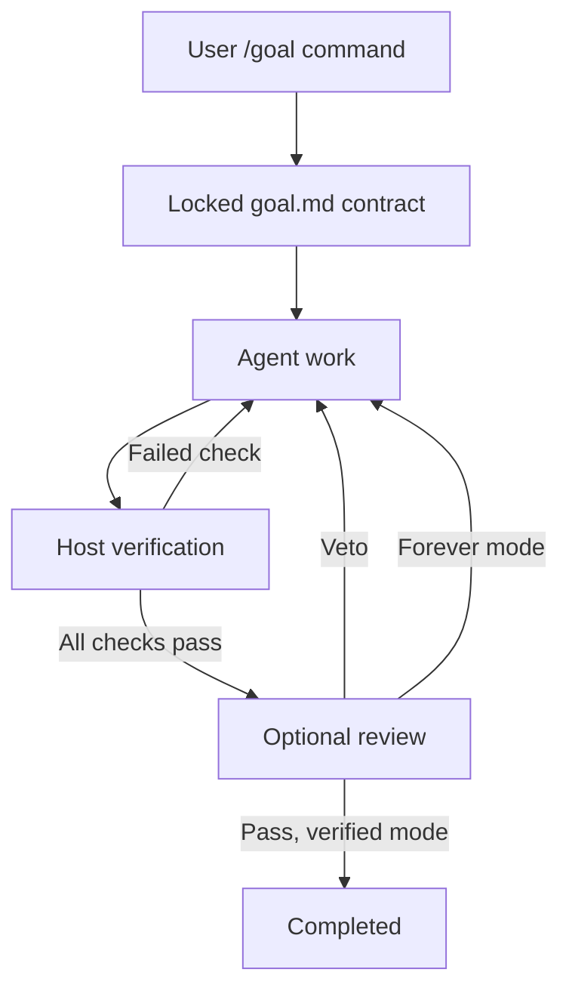

# Architecture

## Control ownership

The host's `/goal` command is the control plane. The model receives only a read-only `mastergoal_status` tool. There is no model-facing complete, stop, revise-contract, or force-pass tool. A host command binds one run to one canonical project directory and one session.

The original core engine is independent of OpenCode. Adapters provide command registration, session-end observations, prompt dispatch, context injection, telemetry, and read-only presentation.

## State machine

`active` can transition to `completed` only after a fresh all-pass verification in verified mode. `paused`, `blocked`, and `stopped` never mean success. Paused/blocked runs may resume the same locked contract. Stopped/completed runs require a new start and new run ID. Forever mode has no completion transition.

Errors in individual checks count as unmet evidence and permit further work. Contract integrity failures block the run. Host errors and prompt delivery failures block it for explicit resume. User interruption is honored. Permissions are never auto-approved by this plugin.

Budgets are optional and produce pause rather than completion. They are tested at continuation boundaries; they are not hard billing limits.

## Persistence and concurrency

State lives outside the workspace and is scoped by SHA-256 hashes of canonical root and session ID. Snapshot writes use a temporary file, fsync, and rename. `proper-lockfile` serializes writers with a heartbeat and stale-lock recovery after 30 seconds. Directory files use owner-only permissions on systems that support them.

Verification uses a durable unique token. Work runs outside the write lock so stop/pause can revoke that token and cancel the subprocess. Results are committed only if the run ID, active state, and token still match. Process restarts never reuse successful partial verification. The continuation scheduler coalesces duplicate triggers, records pending admission, and requires an observed new execution before accepting its idle event. This avoids a stale idle notification immediately injecting a second turn.

Run a single OpenCode server per project/session. Separate server processes sharing a session are not a supported active-active topology. File locking protects writes but does not provide a distributed exactly-once prompt-delivery protocol.

## Host API map

| Capability             | OpenCode 1.18.34                                | OpenCode 2.0.22                                    |
| ---------------------- | ----------------------------------------------- | -------------------------------------------------- |
| Commands               | `config`, `command.execute.before`              | `command.transform` with direct execute callback   |
| Continuation           | `session.idle`, `session.status`, `promptAsync` | execution events, `session.prompt` queued delivery |
| Context                | system transform                                | `session.hook('context')`                          |
| Compaction             | experimental compacting hook                    | `session.hook('compaction')`                       |
| Direct edit protection | tool before hook                                | tool before hook                                   |
| Usage                  | completed assistant messages                    | completed provider steps                           |
| Sidebar                | `sidebar_content`, local state                  | `sidebar.content`, server RPC                      |
| Lifecycle cleanup      | plugin dispose                                  | returned cleanup and registration disposal         |

1.x has no general documented stop-veto hook. Its adapter continues after idle; it does not pretend to install a nonexistent hook. 2.x exposes direct commands and native execution events. Only relevant, supported hooks are used; changing model parameters, auth hooks, or provider transport would not strengthen completion verification.

## Security and truth boundaries

This design guards against premature natural-language completion and ordinary accidental contract edits. It is not a hostile-agent sandbox. A process with unrestricted shell access and the same user identity may rewrite plugin state, alter runtime dependencies, replace an interpreter, or race checks. Hash checks do not authenticate user intent against that attacker. Direct structured-edit protection is best effort and cannot parse all possible shell commands.

For untrusted agents, enforce boundaries outside this plugin: read-only verifier mounts, separate users/containers, a fixed artifact identity, restricted credentials, and a remote attestation service. A successful exit code is as trustworthy as the verifier, its inputs, and its execution environment.

## Telemetry

Host-reported input/output/reasoning/cache token fields are aggregated once per message/step identity. Cumulative updates increase counts without double-counting or subtracting prior usage. The ledger deliberately retains every identity during the run; this trades growing state size for exact replay protection. Very large indefinite runs should be rotated deliberately if state serialization becomes expensive. Last 200 lifecycle/usage entries remain in the human-readable history.

The sidebar is read-only. It never alters host todos to create a cosmetic success percentage. Check coverage is separate from native planning. The 2.x sidebar uses RPC so it does not read a misleading client-local file when attached to a remote server.
