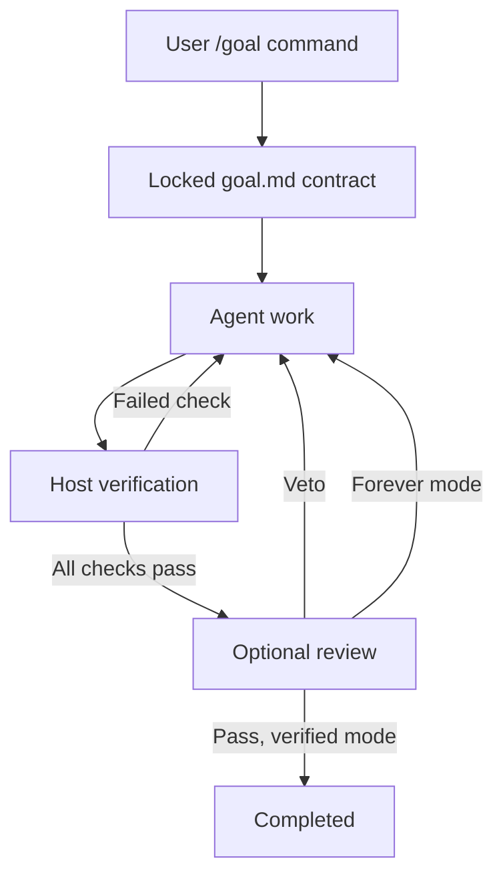

# Architecture

## Control ownership

The host's `/goal` command is the control plane. The model receives only a read-only `mastergoal_status` tool. There is no model-facing complete, stop, revise-contract, or force-pass tool. A host command binds one run to one canonical project directory and one session.

The original core engine is independent of OpenCode. Adapters provide command registration, session-end observations, prompt dispatch, context injection, telemetry, and read-only presentation.

## State machine

`active` can transition to `completed` only after a fresh all-pass verification in verified mode. `paused`, `blocked`, and `stopped` never mean success. Paused/blocked runs may resume the same locked contract. Stopped/completed runs require a new start and new run ID. Forever mode has no completion transition.

Errors in individual checks count as unmet evidence and permit further work. Contract integrity failures block the run. Host errors and prompt delivery failures block it for explicit resume. User interruption is honored. Permissions are never auto-approved by this plugin.

Budgets are optional and produce pause rather than completion. They are tested at continuation boundaries; they are not hard billing limits.

## Persistence and concurrency

State lives outside the workspace and is scoped by SHA-256 hashes of canonical root and session ID. Snapshot writes use a temporary file, fsync, and rename. `proper-lockfile` serializes writers with a heartbeat and stale-lock recovery after 30 seconds. Directory files use owner-only permissions on systems that support them.

Verification uses a durable unique token. Work runs outside the write lock so stop/pause can revoke that token and cancel the subprocess. Results are committed only if the run ID, active state, and token still match. Process restarts never reuse successful partial verification. The continuation scheduler coalesces duplicate triggers, records pending admission, and requires an observed new execution before accepting its idle event. This avoids a stale idle notification immediately injecting a second turn.

Run a single OpenCode server per project/session. Separate server processes sharing a session are not a supported active-active topology. File locking protects writes but does not provide a distributed exactly-once prompt-delivery protocol.

## Host API map

| Capability      | OpenCode 2.x                                       |
| --------------- | -------------------------------------------------- |
| Commands        | `command.transform` with direct execute callback   |
| Continuation    | execution events, `session.prompt` queued delivery |
| Context         | `session.hook('context')`                          |
| Compaction      | `session.hook('compaction')`                       |
| Edit protection | tool before hook                                   |
| Usage           | completed provider steps                           |
| Sidebar         | `sidebar.content`, server RPC                      |
| Cleanup         | returned cleanup and registration disposal         |

Only the native 2.x host API is supported. The server plugin registration also advertises its TUI entrypoint; no separate legacy terminal configuration is written.

## Security and truth boundaries

This design guards against premature natural-language completion and ordinary accidental contract edits. It is not a hostile-agent sandbox. A process with unrestricted shell access and the same user identity may rewrite plugin state, alter runtime dependencies, replace an interpreter, or race checks. Hash checks do not authenticate user intent against that attacker. Direct structured-edit protection is best effort and cannot parse all possible shell commands.

For untrusted agents, enforce boundaries outside this plugin: read-only verifier mounts, separate users/containers, a fixed artifact identity, restricted credentials, and a remote attestation service. A successful exit code is as trustworthy as the verifier, its inputs, and its execution environment.

## Telemetry

Host-reported input/output/reasoning/cache token fields are aggregated once per message/step identity. Cumulative updates increase counts without double-counting or subtracting prior usage. The ledger deliberately retains every identity during the run; this trades growing state size for exact replay protection. Very large indefinite runs should be rotated deliberately if state serialization becomes expensive. Last 200 lifecycle/usage entries remain in the human-readable history.

The sidebar is read-only. It never alters host todos to create a cosmetic success percentage. Check coverage is separate from native planning. The 2.x sidebar uses RPC so it does not read a misleading client-local file when attached to a remote server.

## Construction phase

`/goal construct` is an explicitly requested preparation turn using the host's current model and tools. It accepts ordinary Markdown without a pre-existing contract. The original document and construction instructions are saved outside the project in session state and reinjected during context creation and compaction. No active, paused, or blocked run may enter construction; stop that run first. Successful start clears the construction context and pins the generated contract through the normal engine. Construction itself cannot mark a goal complete.

The model edits draft files through OpenCode's ordinary tools and permission system. This phase is intentionally distinct from the locked verification loop: it may ask questions or need another turn. Generated acceptance criteria require inspection; neither the parser nor a model can establish semantic equivalence between arbitrary prose and executable checks. Optional reviewer scripts still require their own configured service and may only veto deterministic success.

## Rolling image window (OpenCode 2.0.22)

Persistent history is translated by `SessionModelRequest.baseTranscript` / `toLLMMessages` into canonical `@opencode/ai` messages. The existing `context` and `compaction` callbacks now apply `applyImageWindow` and then inject goal context. Separate `generate` and `title` hooks filter auxiliary session requests because those flows do not trigger `context`. The host builds its `LLMRequest` from the modified messages before protocol serialization; its later unsupported-media and byte-budget passes cannot add images.

`src/image-window.ts` walks messages and content backwards, retaining the newest N images globally, then reconstructs changed containers in normal order. Complexity is O(messages + parts), including tool-result content. There is no image decoding or network access. Retained `Media.Asset` instances and large payloads are shared; source arrays/messages/results are never mutated. Image-only messages emptied by filtering are removed. An image-only tool result becomes a text-only removal notice so its matching tool call remains valid.

The exact image representations are `media` parts whose `Media.Asset.kind` is `image` or `mediaType` starts with `image/`, and `tool-result.result` with `type: content` containing `file` items with an `image/` MIME type. Assets support bytes, base64, URLs and provider references. The host converts user attachments to media assets and tool/MCP screenshot outputs to file content before these hooks. JSON/text that merely mentions an image is not media. PDFs/audio/source files remain untouched.

Native `plugins: [{ package, options: { imageWindow: 1 } }]` supplies `ctx.options`. The selected value is validated at startup, with explicit options over environment over default. It is not goal state and does not affect locking or lifecycle semantics. RPC appends the effective value for the sidebar. Installer replacement preserves options.

Source inspection: upstream v2 commit `f74512bfe0ad5264acd58ab6d7548eae427f75f5` (package version 2.0.22), `packages/core/src/session/model-request.ts`, `runner/to-llm-message.ts`, `packages/plugin/src/promise/session.ts`, `packages/schema/src/config/plugin.ts`, and the installed 2.0.22 AI media/tool schemas and protocol lowering. No dependency upgrade was required.

This is request-context filtering, not persistent-history cleanup. No universal final-hook priority exists in this API: later third-party hooks must not reinsert media. Opaque provider-side history and external model calls lie outside this canonical raw-image boundary.
